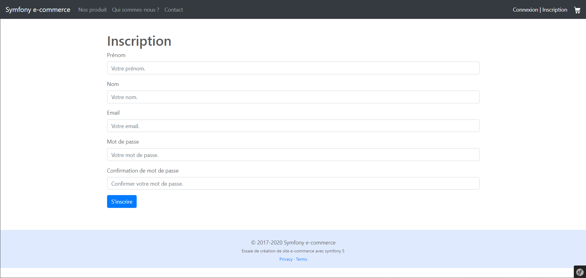
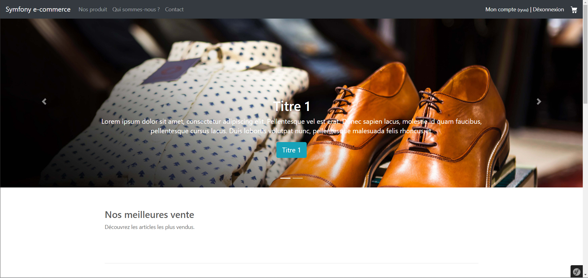
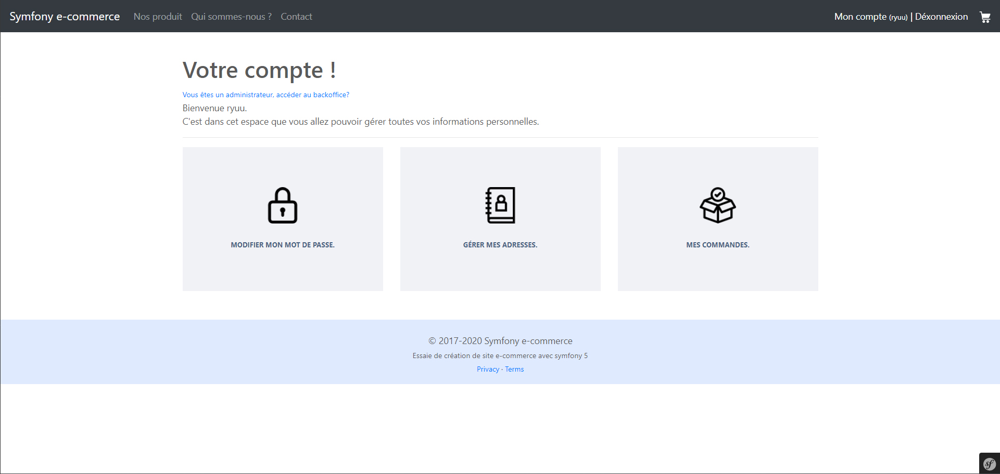
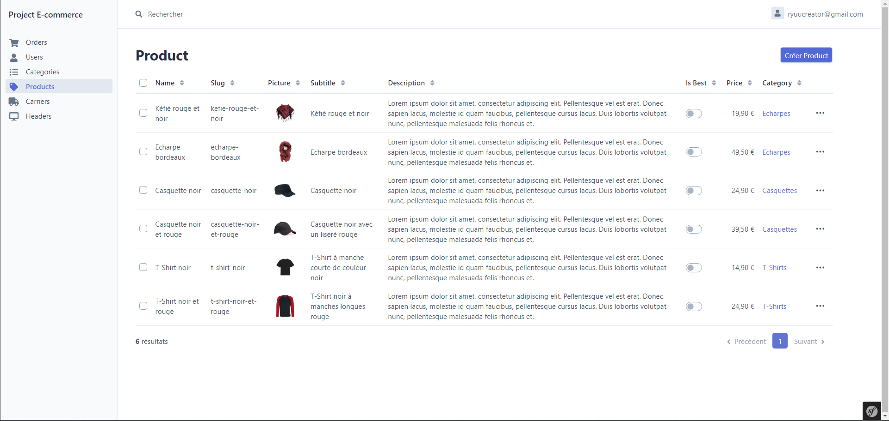
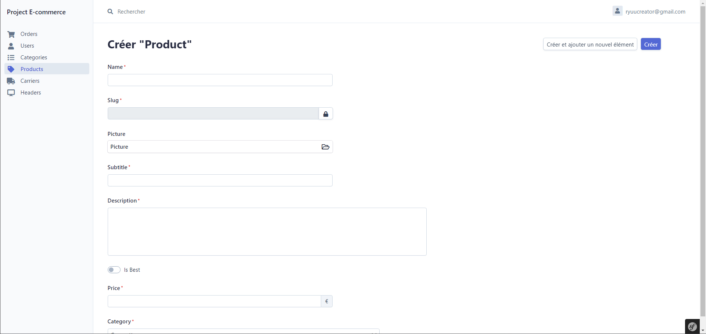
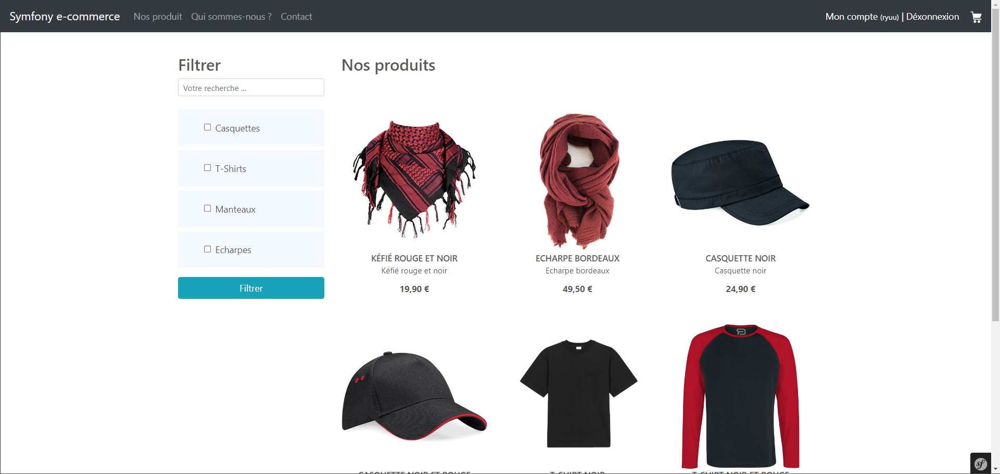
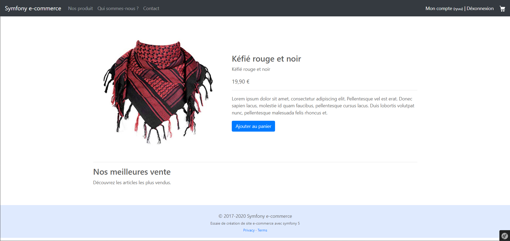
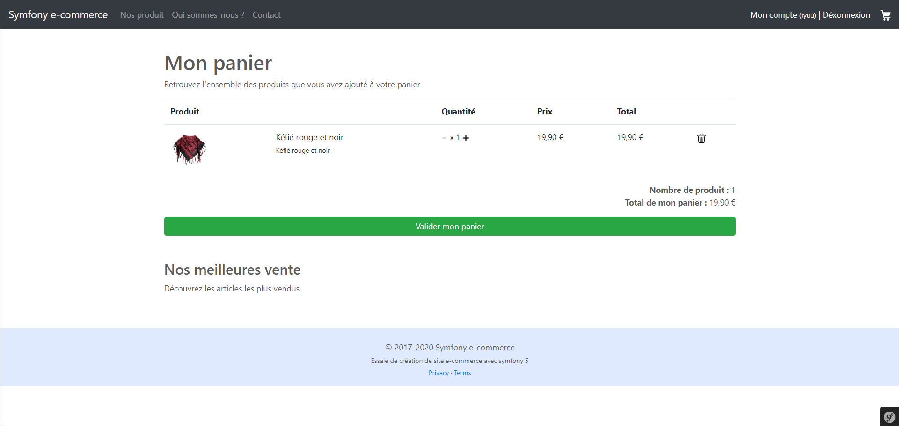
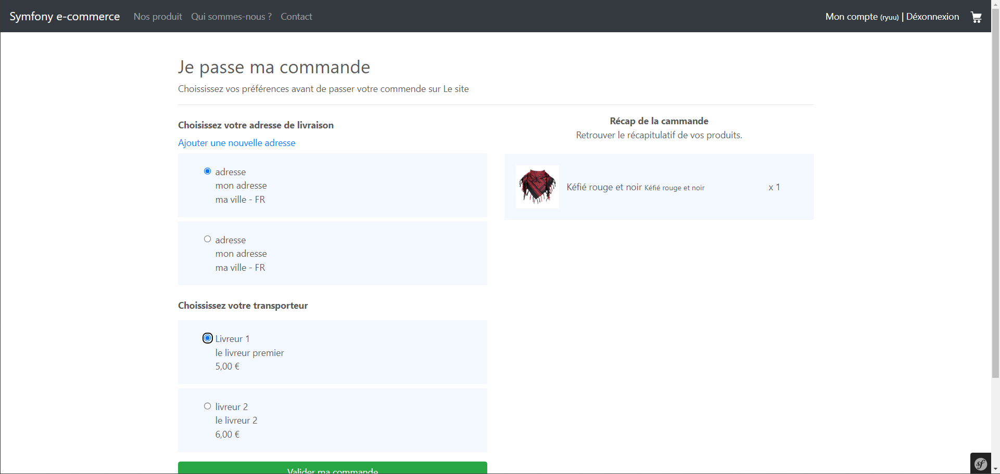
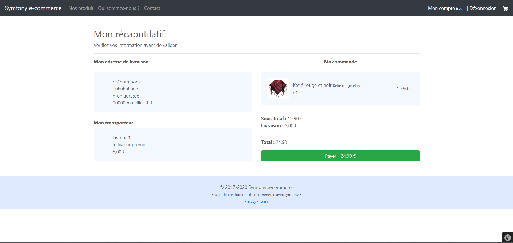

# Symfony_ecommerce

## Description
Ce projet est un site e-commerce développé dans le cadre de mon projet actuel. Il s'agit d'un site web permettant la vente de produits en ligne.

La stack technique utilisée pour ce projet est la suivante :

- PHP 7
- MySQL v5
- Framework Symfony 5.4
- ORM - Doctrine
- Moteur de rendu Twig
- Easyadmin 3.5
- Vanilla JS
- CSS Flexbox

Le site offre aux utilisateurs la possibilité de parcourir les produits disponibles, de les ajouter à leur panier et de passer des commandes en ligne. Les utilisateurs peuvent également créer des comptes et gérer leurs informations personnelles.

Pour les administrateurs, un tableau de bord est disponible offrant un accès rapide aux fonctionnalités suivantes :

- Gestion des utilisateurs
- Gestion des commandes
- Gestion des catégories
- Gestion des produits
- Gestion des transporteurs
- Gestion des en-têtes

Le moteur de template Twig, inclus par défaut avec le Framework Symfony, est utilisé pour la création des interfaces utilisateur, offrant ainsi une expérience fluide et conviviale.

## Installation

1. Clonez le dépôt : **`git clone https://github.com/RyuuCreator/Symfony_ecommerce`**
2. Installez les dépendances : **`composer install`**
3. Configurez la base de données dans le fichier **`.env`**
4. Créez la base de données : **`symfony console doctrine:database:create`**
5. Exécutez les migrations : **`symfony console doctrine:migrations:migrate`**

## Utilisation

Pour lancer le serveur de développement, exécutez la commande suivante:

**`symfony server:start`**

Accédez ensuite à votre application dans votre navigateur à l'adresse [http://localhost:8000](http://localhost:8000).

Pour créer un compte administrateur, utilisez la commande personnalisée `app:create-admin`. Cette commande vous guidera à travers le processus de création d'un nouvel utilisateur avec le rôle administrateur.

**`symfony console app:create-admin`**

Vous serez invité à fournir les informations nécessaires pour créer le compte administrateur, telles que l'adresse e-mail, le mot de passe, le prénom et nom. Une fois les informations saisies, un nouvel utilisateur avec le rôle administrateur sera créé et ajouté à votre base de données.

## Screenshots

### Page d'inscription
 
Cette capture d'écran montre la page d'inscription où les utilisateurs peuvent créer un nouveau compte.

### Page d'accueil

Cette capture d'écran illustre la page d'accueil de l'application.

### Page de compte utilisateur
 
Cette capture d'écran montre la page de compte utilisateur où les utilisateurs peuvent gérer leurs informations personnelles.

### Dashboard administrateur

Cette capture d'écran montre le tableau de bord administrateur offrant un accès rapide aux fonctionnalités de gestion.

### Page de création de produit (admin)

Cette capture d'écran présente la page permettant à l'administrateur de créer un nouveau produit.

### Page des produits

Cette capture d'écran illustre la page des produits où les utilisateurs peuvent parcourir et consulter les produits disponibles sur la plateforme de commerce électronique.

### Page détail du produit

Cette capture d'écran présente la page détaillant un produit spécifique.

### Page du panier

Cette capture d'écran montre le panier où les utilisateurs peuvent voir les produits ajoutés.

### Page de validation de la commande

Cette capture d'écran présente la page où les utilisateurs peuvent valider leur commande.

### Page de paiement

Cette capture d'écran montre la page de paiement où les utilisateurs peuvent effectuer le paiement.

## Auteur

- [Mickael Tailhades](https://www.linkedin.com/in/mickael-tailhades/)
